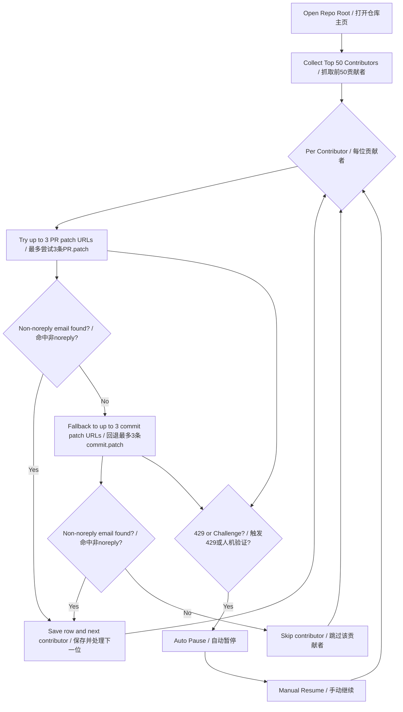

<div align="center">

# GES — GitHub Email Scanner

### Public-Only Intelligence for GitHub Outreach.


<br/>


</div>

---

## What It Is | 项目定位

**GES** is a Chrome/Edge extension that automates a high-friction GitHub workflow: finding contributor emails from **public pages and `.patch` content only**.

**GES** 是一个 Chrome/Edge 扩展，用于自动化你原本高成本的 GitHub 邮箱查找流程，并严格限定在 **公开页面与 `.patch` 文本** 范围内。

It is designed for teams that need structured outreach intelligence with clear boundaries, stable pacing, and export-ready records.

它适合需要外联线索、同时强调边界清晰、节奏稳定、可导出结果的团队。

> **Privacy Statement | 隐私声明**  
> This extension only processes publicly available GitHub information and does not attempt to access private data or bypass access controls.  
> 本插件仅处理 GitHub 公开可见信息，不会访问私有数据，也不尝试绕过任何访问控制机制。

---

## From Click Chaos to One-Click Clarity | 从繁琐点击到一键清晰

### Manual Flow (Before) | 手工流程（之前）
1. Open repository page and enter contributors.
2. Open contributor profile and find activity.
3. Open PR/commit details.
4. Append `.patch` and open raw patch.
5. Parse header and extract email manually.

1. 打开仓库页，进入 contributors。
2. 进入贡献者主页，定位活动记录。
3. 打开 PR/commit 详情。
4. 拼接 `.patch` 打开原始补丁。
5. 人工解析头部并摘取邮箱。

### GES Flow (Now) | GES 自动流程（现在）
1. Open a GitHub repository root page.
2. Click **Start Scan** (page button or popup).
3. Review table and export CSV.

1. 打开 GitHub 仓库根页面。
2. 点击 **开始扫描**（页面按钮或弹窗按钮）。
3. 查看结果表格并一键导出 CSV。

---

## Core Logic | 核心逻辑



---

## Feature Snapshot | 功能快照

| Feature | Description (EN) | 说明（中文） |
|---|---|---|
| Source Constraint | Public GitHub pages + `.patch` only | 仅公开页面与 `.patch` |
| API Policy | No GitHub API | 不调用 GitHub API |
| Contributor Scope | Auto collect first 50 contributors | 自动抓取前 50 位贡献者 |
| PR Budget | Max 3 PR attempts per contributor | 每人最多尝试 3 条 PR |
| Commit Fallback | Up to 3 commit attempts when PR fails | PR 失败后回退最多 3 条 commit |
| Email Filter | Exclude all `noreply` patterns | 过滤所有 `noreply` 邮箱 |
| Runtime Control | Serial queue + random jitter | 串行队列 + 随机抖动 |
| Risk Mode | Standard / Low-risk mode | 标准 / 低风控模式 |
| Verification Handling | Auto pause on challenge/429, manual resume | 触发验证/429自动暂停，手动继续 |
| Export | Popup table + one-click CSV | 弹窗表格 + 一键导出 CSV |

---

## Risk & Compliance Guardrails | 风控与合规护栏

- **Public-only extraction**: only parses publicly visible information.
- **Privacy-safe scope**: limited to public information retrieval and does not involve privacy infringement.
- **No private data bypass**: does not bypass login/captcha/security mechanisms.
- **Compliance confirmation toggle**: optional second confirmation before starting scans.
- **Adaptive safety behavior**: supports low-risk mode and challenge-triggered pause.
- **Retention control**: local scan state has retention TTL.

- **仅公开信息提取**：仅解析公开可见内容。
- **隐私安全范围**：仅针对公开信息获取，不涉及侵犯隐私。
- **不绕过私有边界**：不绕过登录/验证码/安全机制。
- **合规二次确认**：可开启“启动前二次合规确认”。
- **安全节奏控制**：支持低风控模式与验证触发暂停。
- **存储保留期控制**：本地扫描状态带有保留期限。

> Important / 重要：Use this tool lawfully and responsibly. Do not use it for spam, harassment, or policy-violating outreach.
>
> 请合法、合规、审慎使用。禁止用于垃圾骚扰、违规外联等行为。

---

## Quick Start | 快速开始

### 1) Load Extension (Chrome/Edge) | 加载扩展
1. Open `chrome://extensions` (or `edge://extensions`).
2. Enable **Developer mode**.
3. Click **Load unpacked** and select:
   `extension/`

1. 打开 `chrome://extensions`（或 `edge://extensions`）。
2. 打开**开发者模式**。
3. 点击**加载已解压的扩展程序**，选择目录：
   `extension/`

### 2) Run Scan | 开始扫描
1. Open any GitHub repository root page.
2. Click `开始邮箱扫描` on-page button or popup `开始扫描`.
3. If challenge appears, extension pauses automatically.
4. Click `继续` after manual verification.

1. 打开任意 GitHub 仓库主页。
2. 点击页面按钮 `开始邮箱扫描` 或弹窗按钮 `开始扫描`。
3. 若触发验证，扩展会自动暂停。
4. 你手动处理后点击 `继续`。

### 3) Export CSV | 导出 CSV
- Click popup `导出 CSV` to download results.
- 点击弹窗 `导出 CSV` 导出结果。

---

## Output Schema | 导出字段

| Field | Meaning (EN) | 含义（中文） |
|---|---|---|
| `contributor_login` | GitHub login | 贡献者 GitHub 用户名 |
| `email` | First matched non-`noreply` email | 首个命中的非 `noreply` 邮箱 |
| `source_type` | `PR` or `commit` | 来源类型：`PR` 或 `commit` |
| `source_url` | URL where email was extracted | 命中邮箱对应来源链接 |
| `extracted_at` | ISO timestamp | 提取时间（ISO 格式） |

---

## Local Development | 本地开发

```bash
npm install
npm test
```

Project structure (core):

```text
extension/
  background.js
  content.runtime.js
  popup.html
  popup.js
  core/
    orchestrator.js
    sourceResolver.js
    patchExtractor.js
    pageDriverFetch.js
    storage.js
    csv.js
tests/
```

---

## Design & Planning Docs | 设计与规划文档

- [Design Spec](2026-04-09-github-contributor-email-plugin-design.md)
- [Implementation Plan](docs/superpowers/plans/2026-04-09-github-contributor-email-extension.md)
- [Risk Guardrails Skill](docs/skills/github-extension-risk-guardrails/SKILL.md)

---

## Current Status | 当前状态

- Core workflow implemented.
- Risk controls implemented (low-risk mode, pause/resume, compliance confirm).
- Test suite passing.

- 核心流程已实现。
- 风控机制已实现（低风控、暂停/继续、合规确认）。
- 测试通过。

---

## License | 许可证

License is not declared yet.

暂未声明正式许可证（建议后续补充 `LICENSE` 文件）。
